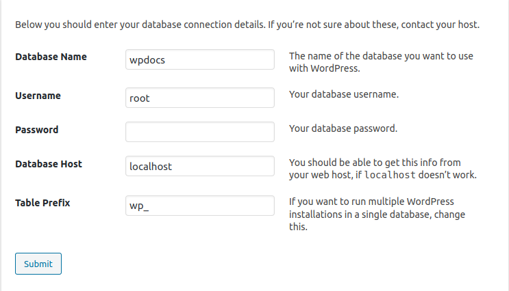

## WP

1. [Download_WP](https://rup.wordpress.org/download/)
2. move to xampp folder 
3. Start xampp `~/Desktop/xampp` -> don't forget to start MySQL and Apache
4. `nautilus /opt/lampp/htdocs`
5. Extract the .zip
6. [PHPMyadmin](http://localhost/phpmyadmin/)
7. Create a new database there -> Databases, choose utf_general_ci
8. Go to localhost and click on the wp folder... -> this will start the installation process.
::: details Config details

- If it displays `Unable to write to wp-config.php file.`
Just copy the file in `wp-config.php`
- Site Title: wpdocs
- username: wpdocs
- pw s2fy@tgzA)zVAfmoG4 - to remind myself
:::


## Plugins

### Basic Setup
1. Go to `wp-content/plugins`
2. Delete everything inside.
3. Put *acf* - the only needed plugin for now
4. In order to active in `wp-admin` -> *Plugins* -> **Activate**

### Hello World of plugins

_We are going to create a plugin that manages a school system_

::: details Code example
In our plugin directory create 2 files:
`index.php` 

```php
/* Plugin Name: MyPlugin */
add_action( 'admin_menu', 'somename' );
function somename() { // where the action admin_menu is ran -> we call this fn to initiate our plugin. The name doesn't matter.
  add_menu_page(
    'somename_Page', // page title when you access /wp-admin/admin.php?page=somename
    'somename', // The text to be used for the menu
    'manage_options', // The capability required for this menu to be displayed to the user
    'somename', // menu slug
    'html', // we write everything in this function
    '', // optional icon - will default to cog
    1 // position in the menu - in our case it will be located on top
  );
}
include WP_PLUGIN_DIR . "/myPlugin/html.php"; // the dir of the plugin is called myPlugin
```

`html.php`
```php
<?php function html() { ?>
  <div class='wrap'>Hello World for plugins</div>
<?php } ?>
```
When we go to our plugin page we should see this html.
:::

### Register our [custom post types](https://developer.wordpress.org/reference/functions/register_post_type/)

1. Register in `functions.php` in our theme folder.
```php
add_action( 'init', 'my_cpt_init' );
function my_cpt_init() {
  $custom_posts = ["student", "teacher", "subject", "lesson", "day"]; // just loop
  foreach($custom_posts as $custom_post) {
    register_post_type($custom_post, [
      "label" => $custom_post,
      "public" => true,
    ]);
  } // there are a lot of args listed in the docs
}
```
Based on that there now are the new post types in the admin menu.

2. Using acf functionality - attach different fields to the newly created post types - in _Custom Fiels_ menu in [wp](http://localhost/doc_wp/wp-admin/post-new.php?post_type=acf-field-group).
- Add new, let's use the same name as the cpt, so _student_. This is the name of the cpt and isn't related to the fields.
- + Add Field
- Just fill `Field Label` and `Field Name` with student. The value we access with php is the value of __Field Name__.
- Show this field group if Post Type is equal to student in the Location section.

__List of starting subjects__: done
__List of students__ - I would like to be able to bulk insert them from a json file.
- create a json from a list of dota [heroes](https://dota2.gamepedia.com/Heroes)

::: details How did I extract the data from there
1. get all the heroes and write the data to localstorage
```js
(() => {
  let array = Array.from(document.querySelectorAll("table tr td"));
  let data = []
  array.map(table => {
    table.childNodes.forEach(el => {
      data.push($(el).find('a').attr('title'))
    })
  })
  localStorage.setItem('data', JSON.stringify(data))
})();
```
2. Then simply copy it to json file.
:::

::: details Writing data from JSON file to wp cpt in a plugin
1. Create your own action in the plugin:
```php
add_action('wp_ajax_myAPI', 'myAPI');
add_action('wp_ajax_nopriv_myAPI', 'myAPI');
```
2. Send data from anywhere to this action with jQuery
```js
  $.ajax({
    url: "http://localhost/doc_wp/wp-admin/admin-ajax.php",
    method: "POST",
    dataType: 'json',
    data: { action: 'myAPI' },
    success: res => {}, // work here
  })
```
I omitted things for simplicity. As one can see action corresponds to the name of the function in the plugin
3. Create function in the plugin
```php
function myAPI() {
  $url = get_template_directory_uri()."/" . $file;
  $request = wp_remote_get( $url );
  $body = wp_remote_retrieve_body( $request );
  echo $body;
  die();
}
```
This is an example function for getting local json file. `$file` corresponds to `heroes.json` in this case. It's located in the root of the theme.
4. Creating cpt from json. Continue from 3.
```php
foreach($array as $student) {
  $newPostID = wp_insert_post([ // we need only these 3 fields...
    "post_title" => $student,
    "post_type" => "student",
    "post_status" => "publish",
  ]);
  update_field("student", $student, $newPostID); // acf
}
```
:::

## Themes
By default there are 3 themes and __Twenty Twenty__ is active. 
::: details For a theme you actually need 3 files:
- `index.php` This is the default route 
- `style.css` You write theme config there. `/* Theme Name: MyTheme */`
- `functions.php` Here you customize your theme
:::

